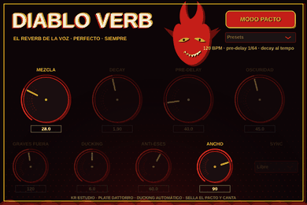

# 🔥 DIABLO VERB — el reverb de la voz, perfecto, siempre

Plugin **VST3** para FL Studio (y cualquier DAW compatible con VST3), escrito en C++
con [JUCE](https://juce.com). Estética de póster infernal: tinta negra, rojo diablo,
amarillo serigrafía y tramas de medios tonos con desfase de *misprint*.



*Primera mitad: MODO PACTO activo, con los mandos automáticos atenuados.
Segunda mitad: pacto roto, control manual de los nueve mandos.*

## La receta del "perfecto siempre"

No existe un reverb mágico universal, pero sí una receta de mezcla que hace que una
voz suene profesional en el 95 % de los casos. **Diablo Verb la trae grabada a fuego**
y la aplica sola con el **MODO PACTO** activado:

| Truco | Qué hace | Por qué funciona |
|---|---|---|
| **Pre-delay sincronizado (1/64)** | Lee el BPM de FL Studio y separa la cola de la voz una fusa exacta | La voz queda delante y el reverb detrás, sin sonar a eco |
| **Decay al tempo (~4 negras)** | La cola muere respirando con la canción | En temas rápidos no embarra; en lentos no se queda corta |
| **Graves fuera (130 Hz)** | Filtra el aire y el cuerpo antes de entrar al plate | El reverb no ensucia la zona de los graves y el bombo |
| **Oscuridad (damping)** | Recorta agudos de la cola progresivamente | Menos "chssss" metálico, menos eses reverberadas |
| **Ducking automático (6 dB)** | El reverb se aparta mientras cantas y florece en los huecos | Voz grande **e** inteligible a la vez: el truco de todos los mezcladores |
| **Anti-eses en el envío** | De-esser Linkwitz-Riley (~4.8 kHz) solo sobre lo que entra al plate | La cola no escupe "chsss" con cada sibilante; la voz seca no se toca |
| **Mezcla equipotente** | Subir la mezcla no dispara el volumen | Decides por gusto, no engañado por el loudness |

Con el pacto sellado solo quedan dos mandos a tu gusto: **MEZCLA** (cuánto reverb)
y **ANCHO** (cuánto estéreo). Si rompes el pacto, los siete mandos son tuyos.

El motor es un **plate Dattorro** (1997), el algoritmo clásico de placa que se usa
en voces desde hace décadas: difusores de entrada, tanque en ocho con allpasses
modulados y taps de salida repartidos para un estéreo denso y sin flutter.

## Mandos

- **MEZCLA** (0–100 %) — dry/wet equipotente. Empieza por 20–30 %.
- **DECAY** (0.3–8 s) — duración de la cola.
- **PRE-DELAY** (0–250 ms) + **SYNC** (Libre, 1/64, 1/32, 1/16, 1/8) — sincronizado usa el BPM del proyecto.
- **OSCURIDAD** (0–100 %) — damping del tanque + filtro de agudos del envío.
- **GRAVES FUERA** (40–400 Hz) — paso alto del envío.
- **DUCKING** (0–12 dB) — cuánto se aparta el reverb mientras cantas.
- **ANTI-ESES** (0–100 %) — cuánto de-esser aplicar al envío.
- **ANCHO** (0–120 %) — imagen estéreo de la cola.
- **MODO PACTO** — la receta completa, automática, ligada al BPM.

## Presets

En el desplegable de la esquina (y como programas del propio VST3):

- **Modo Pacto** — la receta automática. El punto de partida.
- **Capilla** — corto, oscuro e íntimo. Baladas y voces susurradas.
- **Placa 80s** — placa brillante y ancha con pre-delay generoso. Estribillos.
- **Estadio** — cola larga y enorme con más ducking para no embarrar. Momentos épicos.

## Cómo conseguir el plugin

### Opción A — GitHub Actions (sin compilar nada)

Cada push que toque `reverb-vst/` compila el plugin para **Windows, macOS y Linux**
en GitHub Actions. Entra en la pestaña **Actions** del repo → workflow
**Build Diablo Verb** → última ejecución → descarga el artefacto
`diablo-verb-windows` y descomprime.

### Opción B — Compilarlo tú (Windows)

Necesitas [Visual Studio 2022](https://visualstudio.microsoft.com/) (workload
"Desktop development with C++") y [CMake](https://cmake.org/download/):

```bat
cd reverb-vst
cmake -B build
cmake --build build --config Release --target DiabloVerb_VST3
```

El plugin queda en `build\DiabloVerb_artefacts\Release\VST3\Diablo Verb.vst3`.

## Instalarlo en FL Studio

1. Copia la carpeta `Diablo Verb.vst3` completa a `C:\Program Files\Common Files\VST3\`.
2. En FL Studio: **Options → Manage plugins → Find installed plugins**.
3. Aparecerá **Diablo Verb** (KR Estudio) en Installed → Effects → VST3.
4. Cárgalo en un slot del mixer sobre la pista de la voz, sella el pacto y canta.

> Consejo: úsalo **en insert** sobre la voz con el MODO PACTO puesto. Si prefieres
> trabajar con envíos (send), pon MEZCLA al 100 % en el bus de reverb.

## Capturas de la GUI sin abrir un DAW

`tools/RenderShots.cpp` instancia el plugin, mueve los mandos y guarda la GUI
real como secuencia de PNG (lo que ha generado el GIF de arriba):

```bash
cmake -B build -DDIABLOVERB_BUILD_SHOTS=ON
cmake --build build --target DiabloVerbShots
xvfb-run -a ./build/DiabloVerbShots_artefacts/Release/DiabloVerbShots frames 24
```

## Estructura del código

```
reverb-vst/
├── CMakeLists.txt          # proyecto JUCE (VST3 + Standalone)
├── docs/                   # GIF y captura de la interfaz
├── tools/RenderShots.cpp   # generador de capturas de la GUI
└── src/
    ├── PluginProcessor.*   # parámetros, BPM del host, cadena de audio
    ├── PluginEditor.*      # GUI póster: diablo, llamas, medios tonos
    ├── DiabloLookAndFeel.h # knobs, botones y textos con misprint
    └── dsp/
        ├── PlateReverb.h   # plate Dattorro: difusores + tanque + taps
        ├── Ducker.h        # ducking automático keyed por la voz seca
        └── DeEsser.h       # de-esser de dos bandas para el envío
```
